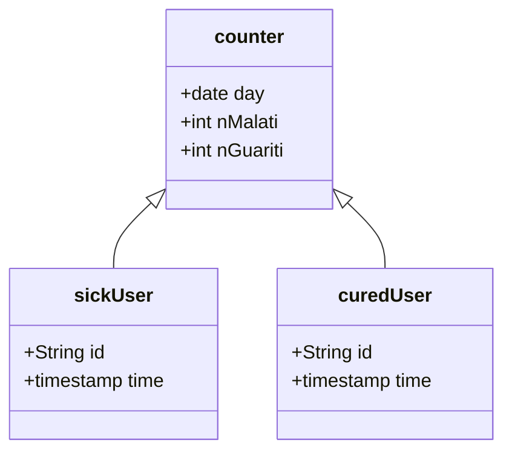

# Analisi

## DB
---
### relazioni & classi

### vincoli

- un utente malato non può ricliccare su malato
- un utente non malato non influisce sul conteggio dei guariti
- un utente malato quando si definisce guarito(cancella record da query malati) [trigger]
- ad un certo orario vengono aggiornati i guaritit e i malati(cancella record da query guariti) [trigger]
  
        Sick User
    | id  | time  |                         
    |-----|-------|                         
    | 001 | 20/05/2022-19:56 |              

        curedUser
    | id  | time  |
    |-----|-------|
    | 001 | 24/05/2022 10:20 |

        counter
    | day | nMalati | nGuariti |
    |-----|---------|----------|
    | 24/05/2022 | 50 | 75 |
    
    - malati totali: ∑(i=0)(n) nMalati => sum(nMalati)
    - malati del giorno: nMalati  
    - attualmente malati: #(sickUser)  => count(sickUser)

## Microservizio
---