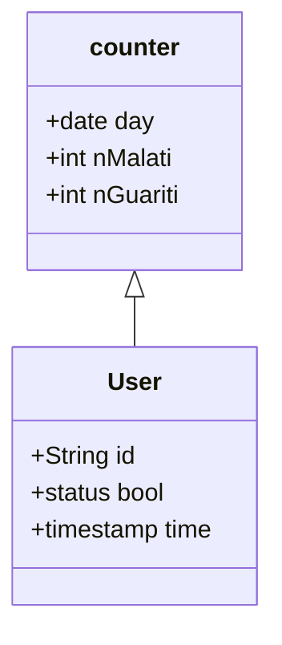

# Analisi

## DB
---
### relazioni & classi

### vincoli

- un utente malato non può ricliccare su malato
- un utente non malato non influisce sul conteggio dei guariti
- un malato dopo un mese viene definito guarito automaticamente
- ad un certo orario vengono aggiornati i guaritit e i malati(cancella record da query guariti) [trigger]
  
        User
    | id  | time  | status |                        
    |-----|-------|--------|                
    | 001 | 20/05/2022-19:56 | 0|              

        counter
    | day | nMalati | nGuariti |
    |-----|---------|----------|
    | 24/05/2022 | 50 | 75 |
    
    - malati totali: ∑(i=0)(n) nMalati => sum(nMalati)
    - malati del giorno: nMalati
    - attualmente malati: #(sickUser)  => count(query status == 1)

## Microservizio
---

Il microservizio avrà le seguenti chiammate:

-**getNumeroMalati()**: ritorna il numero dei malati registrati

-**getNumeroGuartiti()**: ritorna il numero dei malati registrati

-**setMalato(id:String, time:datetime)**: crea un record nella query sickUser con i dati in input [post]

-**setGuarito(id:String, time:datetime)**: crea un record nella query curedUser con i dati in input. Successivamente elimina il record dell'utente malato [post]

-**setValoriGiornalieri()**: effettuato ad una certa ora del giorno, registra in counters i contatori dei nuovi malati e guariti del giorno, successsivamente elimina i record di tutti i guariti giornalieri per ottimizzare il database.

-**getValoriGiornalieri(diorno:date)**: restituisce in output i contatori di un determinato giorno

---
tip: per PostgreSQL consiglia di fare un update piùttosto che delete&insert perchè più efficiente man mano che aumenta la grandezza del DB, quindi potrebbe essere più conveniente unire i malati e i guariti in un'unica query. 
 
