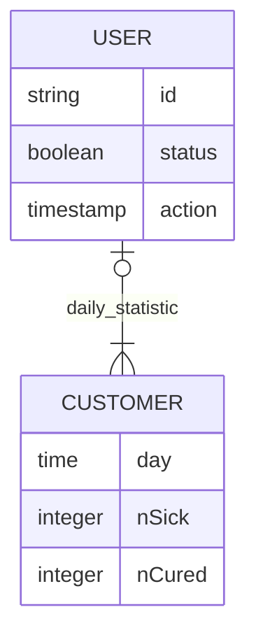

# Report
  - [Introduction](#introduction)
    - [Description](#description)
    - [Deviations](#deviations)
  - [Implementation](#implementation)
    - [DB](#db)
    - [Front](#front)
    - [Microservices](#microservices)
  - [Test & Validation](#test--validation)
    - [Experimental results](#experimental-results)
  - [Conclusion](#conclusion-and-future-implementations)

---

## Introduction
Groups members: Ciammaruconi Daniele; Caparvi Giorgio

Project title: CovidAWS
### Description
Our project’s purpose is to create a cloud application that keeps track about people affected by covid virus. 

We provide a website where a user can see data about people infected and healed by covid virus. An user can also label himself sick or cured with two buttons on the site.

The application relies on the use of Amazon AWS and the following services: 
   - AuroraDB
   - other services
### Deviations
???

---
## Implementation
Analysing the service to be implemented, we decided to implement the following features: 
   - DB service
   - Counter microservice 
   - Eureka microserver

[schema del servizio]

### DB
As for the db, the following entities were analyzed: users and counters.

In the users query, all users who were sick or healed are recorded, along with the times when the operations were performed. To optimize the database, the id of each user is unique, so that a user is not allowed to add himself multiple times to the sick counter. 
In the counters query, on the other hand, the total daily number of sick and healed users is collected at 6 p.m. each day, and to optimize the service, once the counter is created, we remove all healed users from the query, as the system does not benefit from keeping records of healed users after defining that they are no longer sick. 
Below we can see the ER schema.

### Front
For the front-end part we decided to use react to make a simple interface: it allows you to see the counters and through the buttons below you can notify the service if you are positive or healed; to simplify input operations, the call that starts from the buttons contains only a random id. Each time the user refreshes the page, the services will be called to update the counts. Finally at the bottom you can see the counters of the past days.

[screen della pagina del sito]

### Microservices
As for the microservice, we implemented it with Java Spring Boot. 
In the microservice, we have two get calls (to fetch the number of sick and healed users), two post calls(to send statistics) and a scheduled function to generate the daily counter. Thanks to the timestamp in the user query, we were able to correctly implement the function, thus fetching (and subsequently manipulating) all records that were correctly registered by 6:00 p.m. 

[scrivere qui anche la parte inerente allo scaling con Kubernetes]

## Test & Validation
We wanted to test and verify the efficiency of our application with 3 types of tests (multiple reading of data, multiple writing of data, hybrid read/write) with different amounts of requests (10k, 20k, 30k), for a grand total of 9 tests. These were the results: [foto test, magari con grafi e piccole descrizioni]

### Conclusion and future implementations
The advantages of using cloud technologies such as Docker and Kubernetes are obvious. Especially after having developed and tested all our services locally on our computers; first as simple programmes, then as Docker images and finally in a cluster.
We have seen how it is easier for a developer to work without worrying in detail about the network or scalability in the software logic.

In addition, thanks to Kubernetes and scaling policies, we gained benefits such as self-healing and scalability. because any crashed pod is automatically replaced or replicated.
We achieve high data availability thanks to the AWS platform and the AuroraDB service that hosts our database in the cloud.
In the end, our cloud application works well enough, scales well enough not to drop requests and demonstrates how a simple application can serve thousands of requests simply by using cloud technologies

In the future, we hypothesised that we could improve it by making it a full-fledged monitoring service that can handle requests from the population of a nation or country, thus allowing us to extrapolate anonymous statistical data that will allow us in the future to fight the diseases we encounter in a more targeted manner

